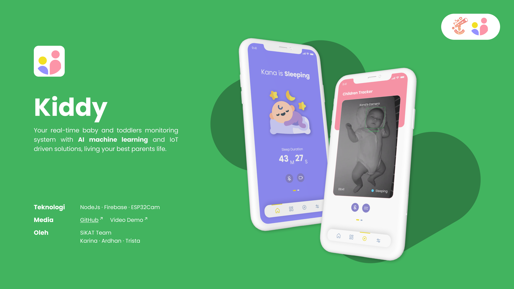
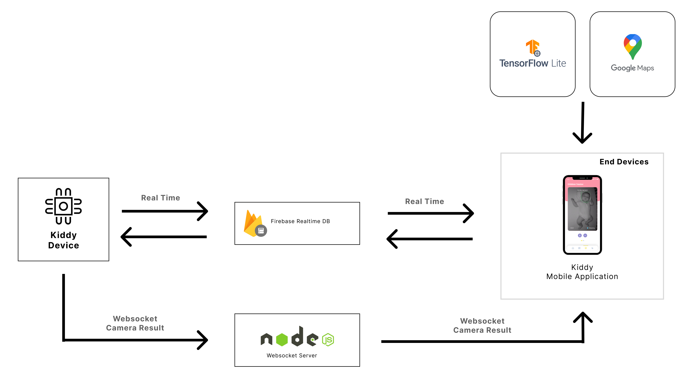
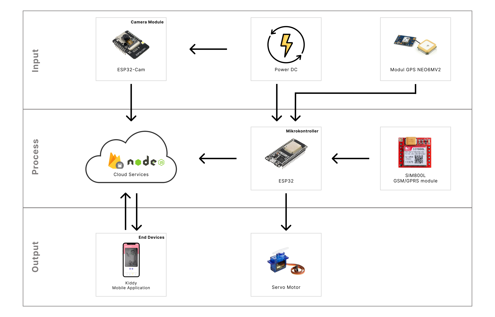

<h1 align="center">
   Kiddy WebSocket Server
</h1>

<p align="center">
  
</p>

<hr>

## Links

> You can access **APK File** [here](https://drive.google.com/file/d/1og0wMm_1jk3bsnlmlk8XCl8vzXXy3PCT/view?usp=sharing).

> You can access this project **Presentation Document** [here]().

> You can access this project **Presentation Video** [here](https://drive.google.com/file/d/1ZAUNiemUF2mXBF-0BICi1y4XO3gFNh7M/view?usp=sharing).

> You can access the **Mobile App** repository [here](https://github.com/SiKAT-FindIT/kiddy).

> You can access the **IoT Devices Code** repository [here](https://github.com/SiKAT-FindIT/kiddy_iot).

> You can access the **IoT Websocket Server** repository [here](https://github.com/SiKAT-FindIT/kiddyserver).

## Table of Contents

1. [General Information](#general-information)
2. [Technologies Used](#technologies-used)
3. [Installation](#installation)
4. [Our Team](#team)
5. [Copyright](#copyright)

<a name="general-information">

## General Information

Kiddy merupakan sebuah sistem monitoring bayi dan anak berbasis Internet of Things dan Machine Learning untuk meningkatkan kesehatan mental bagi seorang ibu. Internet of Things dengan penggunaan machine learning akan mengirimkan deteksi ekspresi wajah pada bayi. Sedangkan pada anak balita, wearable Kiddy bisa digunakan untuk deteksi lokasi. Adapun sistem kami terdiri dari:

- Kiddy App : Aplikasi pemantauan kondisi bayi dan lokasi anak
- Kiddy Device : Pemanfaatan teknologi IoT untuk pemantauan bayi dan anak

<a name="technologies-used"></a>

## Technologies Used

This project using some technologies :

- Flutter 3.19.5 with Dart 3.3.3
- Web Socket
- Firebase
- NodeJs
- Docker
- Tensorflow Lite
- Google Maps API

### Architecture of Kiddy System

<p align="center">
  
</p>

Sistem kami menggunakan Flutter untuk membangun aplikasi mobile. Kemudian, menggunakan Firebase sebagai tempat penyimpanan data yang mampu mengakomodasi kebutuan data yang realtime. Firebase kami pilih karena biaya yang terjangkau untuk memulai sebuah bisnis, serta performa yang sudah memenuhi dari sisi bisnis kami. Websocket yang dibangun menggunakan NodeJs juga kami gunakan untuk keperluan mentransmisikan video melalui WebSocket secara cepat dan real time. Sistem ini juga menggunakan TensorFlow Lite untuk melakukan pemodelan pada fitur deteksi ekspresi bayi. Kemudian, juga menggunakan Google Maps SDK sebagai penampil peta untuk melakukan tracking.

### Architecture of Kiddy IoT Device

<p align="center">
  
</p>

ESP32 sebagai mikrokontroller akan melakukan pengiriman data lokasi dari GPS ke Firebase Realtime Database. Kemudian terdapat pula pengubahan state untuk menggerakan ayunan bayi. Untuk pengambilan data ekspresi secara realtime kami menggunakan ESP32-Cam. Dari modul kamera tersebut data dikirimkan menggunakan Websocket, untuk dapat diproses menggunakan model Tensorflow Lite. Sebagai end device, aplikasi mobile akan menerima data dari Firebase dan Websocket server untuk dapat diolah dan ditampilkan pada pengguna.

<a name="installation">

## Installation

Install all dependencies

```bash
npm install
```

Then, run the development server:

```bash
npm start
```

or using docker

```bash
docker compose up -d
```

<a name="team">

## Our Team

| Nama             | E-Mail                      |
| ---------------- | --------------------------- |
| Ardhan Nur Urfan | 18221118@std.stei.itb.ac.id |
| Reswara Trista   | 18221122@std.stei.itb.ac.id |
| Karina Rahadiani | 18221104@std.stei.itb.ac.id |

<a name="copyright"></a>

## Copyright

<h4 align="center">
  Proposed for FindIT 2024 by SiKAT Team. Copyrights @2024
</h4>

</hr>
